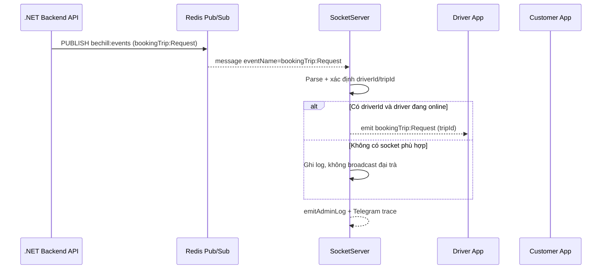
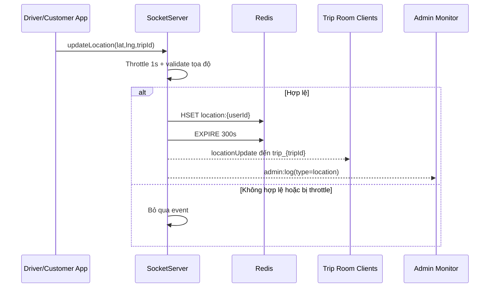
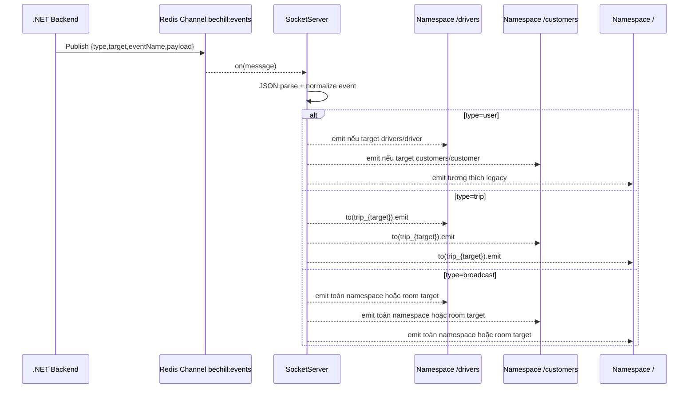

# 03 - Logic nghiệp vụ realtime

## Mục tiêu nghiệp vụ

Đồng bộ trạng thái chuyến đi và vị trí theo thời gian thực giữa:

- Tài xế
- Khách hàng
- Dịch vụ backend

## Luồng kết nối và xác thực

1. Driver/Customer kết nối đến namespace tương ứng.
2. Middleware đọc Authorization header và user_id.
3. Nếu hợp lệ, gán user info vào socket.
4. Server đăng ký socket vào map in-memory + Redis mapping.

## Quản lý room

- Room theo user:
  - driver_{userId}
  - customer_{userId}
- Room theo trip:
  - trip_{tripId}

Hành vi:

- joinTrip: socket join trip_{tripId}
- leaveTrip: socket rời trip_{tripId}

## Vị trí realtime

Event updateLocation được xử lý theo các bước:

1. Throttle 1 giây/socket
2. Validate latitude/longitude
3. Lưu location vào Redis với TTL 5 phút
4. Nếu có tripId, broadcast locationUpdate tới:
  - default namespace room trip_{tripId}
  - /drivers room trip_{tripId}
  - /customers room trip_{tripId}
5. Gửi log monitor tới admin namespace

## Luồng sự kiện nghiệp vụ từ backend (.NET -> Redis -> Socket)

Backend publish vào channel bechill:events. Server map sự kiện bookingTrip theo rules:

1. bookingTrip:Request
- Ưu tiên emit đến tài xế được chỉ định (driverId).
- Không broadcast đại trà khi không tìm thấy driver socket.

2. bookingTrip:Canceled
- Emit bookingTrip:Canceled:{tripId} đến trip room.
- Có thể emit trực tiếp thêm đến driver nếu có driverId.

3. bookingTrip:AcceptedTrip
- Emit bookingTrip:AcceptedTrip:{tripId} đến trip room + customers.
- Nếu có target customerId, emit trực tiếp đến customer sockets.

4. bookingTrip:ToPickUp
- Emit bookingTrip:ToPickUp:{tripId} đến trip room, drivers, customers.

5. bookingTrip:Started
- Emit bookingTrip:Started:{tripId} kèm payload phù hợp.

6. bookingTrip:Completed
- Emit bookingTrip:Completed:{tripId} kèm completed payload.

7. bookingTrip:CompletedWithProblem
- Emit bookingTrip:CompletedWithProblem:{tripId} kèm problemDescription nếu có.

8. bookingTrip:DriverCanceled
- Được map thành bookingTrip:Canceled:{tripId} cho client.

## Generic event routing (ngoài bookingTrip)

Server hỗ trợ event theo type:

- type=user:
  - target=drivers/customers -> namespace broadcast
  - target=userId -> emit đến user room và socketIds từ Redis
- type=trip:
  - emit đến trip_{target}
- type=broadcast:
  - target có giá trị -> broadcast theo room/target
  - target null -> broadcast toàn bộ

## Sequence chính

### 1) Booking request

### 2) Location update

### 3) Redis event fanout

## Disconnect cleanup

Khi socket disconnect:

1. Xóa socket khỏi map in-memory
2. Xóa mapping user-socket trong Redis
3. Xóa socket khỏi room sets trong Redis
4. Xóa throttle state của socket

## Rule quan trọng cần giữ khi phát triển tiếp

- Driver chỉ một socket active
- Customer hỗ trợ đa thiết bị
- Không để Redis outage làm crash process
- Ưu tiên event đến đúng target, hạn chế broadcast thừa
- Giữ backward compatibility cho namespace / (legacy)
